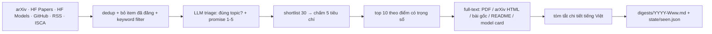

# weekly-paper-digest

Mỗi tuần tự động quét paper, blog/news, repo và model về **speech** (ASR, TTS, Speech Understanding, Voice Agent) trên arXiv, Hugging Face, GitHub, RSS blog và ISCA Archive. Tool chấm điểm từng item theo 5 tiêu chí và viết **tóm tắt chi tiết bằng tiếng Việt từ full-text** cho 10 item tốt nhất.

Digest được commit vào [`digests/`](digests/) dưới tên `YYYY-Www.md`.

## Pipeline



| Nguồn | Cách lấy |
|---|---|
| arXiv | `eess.AS`, `cs.SD` + các bài có từ khóa speech trong `cs.CL/cs.AI/cs.LG` |
| HF Daily Papers | từng ngày trong cửa sổ quét; lấy upvotes và link GitHub làm tín hiệu |
| HF Models | model trending theo pipeline tag speech, tạo trong vòng 30 ngày |
| GitHub | repo mới (≤30 ngày) có topic speech và ≥50 sao |
| RSS | blog của HF, Google, DeepMind, OpenAI, MSR, NVIDIA, AWS, Apple, Daily |
| ISCA Archive | quét mỗi volume hội nghị mới **đúng 1 lần** (ISCA ra bài theo đợt, không theo tuần) |

**Chấm điểm:** mỗi tiêu chí (novelty, credibility, technical, impact, evidence) được chấm 1–5 kèm lý do. Điểm tổng là trung bình có trọng số, quy về thang 0–100.

## Cài đặt

```bash
uv sync
# điền GEMINI_API_KEY vào .env (file này không được commit)
uv run weekly-digest              # chạy đầy đủ, ghi digests/ và state/
uv run weekly-digest --dry-run    # chỉ crawl + filter, không gọi LLM, không ghi file
uv run pytest -q
```

## GitHub Actions

Workflow `.github/workflows/weekly-digest.yml` chạy vào **thứ Hai 08:00 giờ Việt Nam** (có thể bấm chạy tay qua *Run workflow*) và commit digest cùng state về repo.

Workflow cần secret `GEMINI_API_KEY`:

```bash
gh secret set GEMINI_API_KEY --repo minhhoang2705/weekly-paper-digest
```

## Tùy chỉnh

Mọi tham số nằm trong [`config.yaml`](config.yaml): cửa sổ quét, `top_k`, trọng số, mô tả topic, keyword, model Gemini cho từng bước, danh sách RSS và bật/tắt từng nguồn.

`state/seen.json` ghi lại các item đã đăng để tuần sau không lặp. Chạy lại trong **cùng tuần** sẽ tạo lại digest của tuần đó, không loại các item nó đã chọn.
