# weekly-paper-digest

Mỗi tuần tự động quét paper, blog/news, repo và model về **speech** (ASR, TTS, Speech Understanding, Voice Agent) trên arXiv, Hugging Face, GitHub, RSS blog và ISCA Archive. Với 30 ứng viên tốt nhất, tool **đọc full-text** để viết tóm tắt chi tiết bằng tiếng Việt và chấm điểm theo 5 tiêu chí, rồi xếp hạng ra top 10.

Digest được commit vào [`digests/`](digests/) dưới tên `YYYY-Www.md`. Dữ liệu có cấu trúc nằm ở [`data/`](data/). Web UI xem tại **https://minhhoang2705.github.io/weekly-paper-digest/**.

## Pipeline

```mermaid
flowchart LR
    S[arXiv · HF Papers · HF Models · GitHub · RSS · ISCA] --> N[dedup + bỏ item đã đăng + keyword filter]
    N --> F[LLM triage trên abstract: đúng topic? + promise 1-5]
    F --> R[shortlist 30]
    R --> X[full-text: PDF / arXiv HTML / bài gốc / README / model card]
    X --> W[1 lần đọc: tóm tắt chi tiết + chấm 5 tiêu chí]
    W --> T[top 10 theo điểm có trọng số]
    T --> D[digests/*.md · data/*.json · state/seen.json]
    D --> UI[weekly-site → docs/ → GitHub Pages]
```



| Nguồn | Cách lấy |
|---|---|
| arXiv | `eess.AS`, `cs.SD` + các bài có từ khóa speech trong `cs.CL/cs.AI/cs.LG` |
| HF Daily Papers | từng ngày trong cửa sổ quét; lấy upvotes và link GitHub làm tín hiệu |
| HF Models | model trending theo pipeline tag speech, tạo trong vòng 30 ngày |
| GitHub | repo mới (≤30 ngày) có topic speech và ≥50 sao |
| RSS | blog của HF, Google, DeepMind, OpenAI, MSR, NVIDIA, AWS, Apple, Daily |
| ISCA Archive | quét mỗi volume hội nghị mới **đúng 1 lần** (ISCA ra bài theo đợt, không theo tuần) |

**Chấm điểm:** mỗi tiêu chí (novelty, credibility, technical, impact, evidence) được chấm 1–5 kèm lý do, **dựa trên full-text**. Trong cùng một lần gọi LLM, model viết phần phân tích trước rồi mới chấm điểm. Điểm tổng là trung bình có trọng số, quy về thang 0–100. Chỉ bước triage (lọc từ vài trăm xuống 30 ứng viên) dùng abstract. Nếu không lấy được full-text, item được chấm trên abstract, có ghi chú trong UI và cảnh báo trong digest. Chi phí LLM tỉ lệ với `shortlist_size`.

## Cài đặt

```bash
uv sync
# điền GEMINI_API_KEY vào .env (file này không được commit)
uv run weekly-digest              # chạy đầy đủ, ghi digests/, data/ và state/
uv run weekly-digest --dry-run    # chỉ crawl + filter, không gọi LLM, không ghi file
uv run weekly-site                # build web UI tĩnh từ data/ vào docs/
python3 -m http.server -d docs 8000   # xem UI ở http://localhost:8000
uv run pytest -q
```

## Web UI

`weekly-site` đọc `data/*.json` rồi build một site tĩnh (Jinja2, không cần Node) vào `docs/`. GitHub Pages phục vụ site này từ nhánh `main`, thư mục `/docs`.

- **Dashboard:** top 10 của tuần mới nhất, kèm thống kê crawl và cảnh báo.
- **Research Feed:** toàn bộ 30 item đã phân tích mỗi tuần; tìm kiếm, lọc theo topic/loại, sắp xếp theo điểm hoặc ngày.
- **Paper detail:** Summary, Auto Analysis (thu gọn / *Full analysis*), card Ranking với radar 5 tiêu chí, lý do từng tiêu chí, strengths/weaknesses/context.
- **Digest:** lưu trữ theo tuần, có link sang bản Markdown.
- **Settings:** xem (chỉ đọc) nội dung `config.yaml`.
- **Trends, Research Graph, Compare, Research Agent:** hiện trong sidebar nhưng đang disable (chưa làm).

Radar dùng thang 1–5 như lúc chấm điểm. *Ranking score* là điểm tổng có trọng số, thang 0–100.

## Chạy định kỳ bằng cron (trên máy local)

`scripts/run-weekly.sh` là entrypoint cho cron. Script chạy pipeline, build UI, commit `digests/ data/ docs/ state/`, rồi push lên GitHub. Nếu push lỗi, lần chạy sau sẽ push bù.

Cron gọi script **mỗi ngày lúc 08:00**, nhưng mỗi tuần ISO chỉ build digest **một lần**. Nhờ vậy:
- Nếu thứ Hai máy tắt, lần chạy tiếp theo sẽ bù.
- Nếu một lần chạy lỗi, hôm sau script tự thử lại.

```cron
0 8 * * * mkdir -p /home/minhtranh/works/projects/weekly-paper-digest/logs && /home/minhtranh/works/projects/weekly-paper-digest/scripts/run-weekly.sh >> /home/minhtranh/works/projects/weekly-paper-digest/logs/cron.log 2>&1
@reboot sleep 300 && mkdir -p /home/minhtranh/works/projects/weekly-paper-digest/logs && /home/minhtranh/works/projects/weekly-paper-digest/scripts/run-weekly.sh >> /home/minhtranh/works/projects/weekly-paper-digest/logs/cron.log 2>&1
```

```bash
crontab -l                         # xem lịch
tail -f logs/cron.log              # xem log
FORCE=1 scripts/run-weekly.sh      # build lại digest tuần này ngay
```

`GITHUB_TOKEN` được lấy tự động qua `gh auth token` (máy này đã đăng nhập `gh`), nên GitHub Search API dùng hạn mức 30 request/phút. Nếu cần, có thể ghi đè bằng biến trong `.env`.

## Tùy chỉnh

Mọi tham số nằm trong [`config.yaml`](config.yaml): cửa sổ quét, `top_k`, trọng số, mô tả topic, keyword, model Gemini cho từng bước, danh sách RSS và bật/tắt từng nguồn.

`state/seen.json` ghi lại các item đã đăng để tuần sau không lặp. Chạy lại trong **cùng tuần** sẽ tạo lại digest của tuần đó, không loại các item nó đã chọn.
